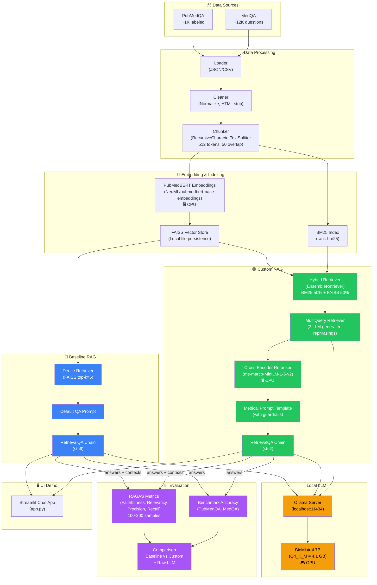
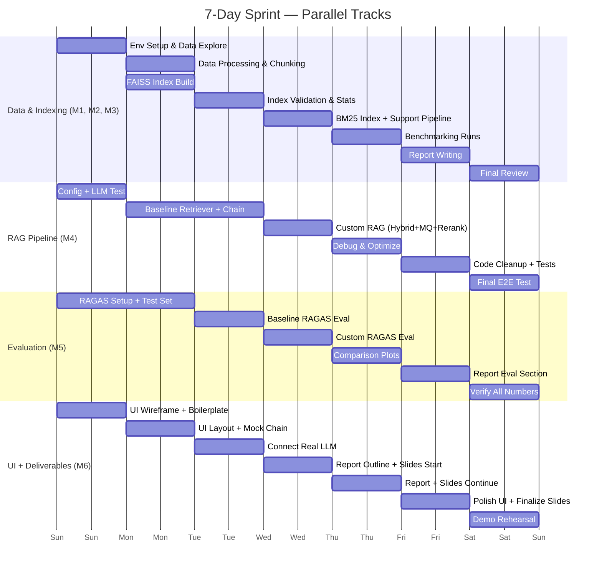

# Medical RAG QA — Sprint Plan (7 Days, 6 Members)

## 1. Project Overview

**Goal:** Build a fully local Medical Question Answering system using RAG (Retrieval-Augmented Generation), evaluated on PubMedQA and MedQA.

**Key Constraint:** Everything runs on **1× RTX 3060 Ti (8 GB VRAM)**. Zero external APIs.

**Deliverables:** Working RAG pipeline (Baseline + Custom), RAGAS evaluation results, Chat UI demo, Source code, Slides & Report.

---

## 2. Pipeline Architecture Diagram



> **Color legend:** 🔵 Blue = Baseline RAG &nbsp;|&nbsp; 🟢 Green = Custom RAG &nbsp;|&nbsp; 🟡 Yellow = Local LLM &nbsp;|&nbsp; 🟣 Purple = Evaluation

---

## 3. Tech Stack (Final)

| Component | Choice | Rationale |
|-----------|--------|-----------|
| **LLM** | **BioMistral-7B-GGUF (Q4_K_M)** via **Ollama** | Medical-domain 7B model. Q4_K_M ≈ 4.1 GB VRAM — leaves ~3.5 GB headroom for embeddings + OS. Ollama provides dead-simple setup with OpenAI-compatible API. |
| **Embedding** | **NeuML/pubmedbert-base-embeddings** (768-dim, ~420 MB) | PubMedBERT-based, trained on biomedical literature. Small enough to run on CPU (via `HuggingFaceEmbeddings` in LangChain) while LLM holds the GPU. |
| **Vector DB** | **FAISS** (local, in-memory + file persistence) | Zero-config, no separate server, saves/loads index as a file. `langchain_community.vectorstores.FAISS` has first-class support. |
| **Framework** | **LangChain** | Required by project spec. Provides chains, retrievers, prompt templates, and document loaders out of the box. |
| **Evaluation** | **RAGAS** with local LLM | Configured to use the same Ollama endpoint instead of default OpenAI. |
| **UI** | **Streamlit** or **Gradio** | Single-file chat UI, fast to build, no frontend skills needed. |

> [!IMPORTANT]
> **VRAM Budget:**
> - BioMistral-7B Q4_K_M ≈ **4.1 GB**
> - Embedding model runs on **CPU** (HuggingFace Transformers) ≈ **0 GPU**
> - FAISS index on **CPU RAM** ≈ **0 GPU**
> - Total GPU usage ≈ **4.1 GB / 8 GB** ✅ Safe margin

### Ollama Setup (One-time)

```bash
# Install Ollama (Windows/Linux/Mac)
# https://ollama.com/download

# Pull the BioMistral model (Q4 quantized)
ollama pull biomistral

# Verify — serves on http://localhost:11434 by default
ollama list
curl http://localhost:11434/api/generate -d '{"model":"biomistral","prompt":"What is hypertension?"}'
```

### Alternative LLM Options (if BioMistral is unavailable on Ollama)

| Model | VRAM (Q4) | Notes |
|-------|-----------|-------|
| `meditron:7b` | ~4.1 GB | Medical-domain, good fallback |
| `mistral:7b` | ~4.1 GB | General but strong reasoning, easily available |
| `llama3:8b` | ~4.5 GB | Newest general model, excellent quality |

---

## 3. Datasets

| Dataset | Size | Format | Use |
|---------|------|--------|-----|
| **PubMedQA** | ~1,000 expert-labeled (pqa_labeled) | JSON | Yes/No/Maybe QA. Use full corpus for indexing, labeled split for eval. |
| **MedQA** (USMLE) | ~12,000+ questions | JSON | Multiple-choice medical QA. Use textbooks for indexing, questions for eval. |

### Data Processing Pipeline

```
Raw JSON/CSV → Parse & Clean → Chunk (512 tokens, 50-token overlap)
    → Embed (PubMedBERT) → Store in FAISS index
```

**Chunking Strategy:**
- `RecursiveCharacterTextSplitter` (LangChain)
- `chunk_size=512`, `chunk_overlap=50`
- Attach metadata: `source`, `doc_id`, `dataset`

---

## 4. Pipeline Architecture

### 4.1 Baseline RAG (Linear / Naive)

```
Question → Embed → FAISS Top-K Retrieval → Stuff into Prompt → LLM → Answer
```

LangChain implementation:

```python
from langchain_community.vectorstores import FAISS
from langchain_community.embeddings import HuggingFaceEmbeddings
from langchain_community.llms import Ollama
from langchain.chains import RetrievalQA
from langchain.prompts import PromptTemplate

# Components
embeddings = HuggingFaceEmbeddings(model_name="NeuML/pubmedbert-base-embeddings")
vectorstore = FAISS.load_local("faiss_index", embeddings, allow_dangerous_deserialization=True)
retriever = vectorstore.as_retriever(search_kwargs={"k": 5})
llm = Ollama(model="biomistral", temperature=0)

# Baseline chain
baseline_chain = RetrievalQA.from_chain_type(
    llm=llm,
    chain_type="stuff",
    retriever=retriever,
    return_source_documents=True
)
```

### 4.2 Custom RAG (Enhanced — for comparison)

Apply **2–3 low-effort, high-impact techniques** on top of Baseline:

---

#### Technique 1: Hybrid Search (BM25 + Dense)

**Why:** Pure dense retrieval can miss keyword-heavy medical terms (drug names, disease codes). BM25 catches exact lexical matches.

```python
from langchain.retrievers import EnsembleRetriever
from langchain_community.retrievers import BM25Retriever

# BM25 on the same document set
bm25_retriever = BM25Retriever.from_documents(documents, k=5)

# Dense (FAISS) retriever
faiss_retriever = vectorstore.as_retriever(search_kwargs={"k": 5})

# Combine 50/50
hybrid_retriever = EnsembleRetriever(
    retrievers=[bm25_retriever, faiss_retriever],
    weights=[0.5, 0.5]
)
```

---

#### Technique 2: Multi-Query Retriever

**Why:** A single question phrasing may miss relevant chunks. LLM generates 3 rephrasings → retrieves from each → merges results. Dramatically improves recall.

```python
from langchain.retrievers import MultiQueryRetriever

multi_query_retriever = MultiQueryRetriever.from_llm(
    retriever=faiss_retriever,
    llm=llm
)
# Internally generates 3 question variants, retrieves for each, deduplicates
```

---

#### Technique 3: Re-Ranking with Cross-Encoder (Optional, CPU-only)

**Why:** Re-ranks the top-K retrieved documents by relevance using a small cross-encoder. Low cost, high precision gain.

```python
from langchain.retrievers import ContextualCompressionRetriever
from langchain_community.document_compressors import CrossEncoderReranker
from langchain_community.cross_encoders import HuggingFaceCrossEncoder

# Small cross-encoder (~130MB, runs on CPU)
reranker_model = HuggingFaceCrossEncoder(model_name="cross-encoder/ms-marco-MiniLM-L-6-v2")
compressor = CrossEncoderReranker(model=reranker_model, top_n=3)

reranking_retriever = ContextualCompressionRetriever(
    base_compressor=compressor,
    base_retriever=hybrid_retriever
)
```

---

#### Custom RAG — Full Chain

```python
from langchain.chains import RetrievalQA
from langchain.prompts import PromptTemplate

medical_prompt = PromptTemplate(
    input_variables=["context", "question"],
    template="""You are a medical AI assistant. Use ONLY the provided context to answer.
If the context does not contain enough information, say "I cannot determine this from the provided context."

Context:
{context}

Question: {question}

Answer:"""
)

custom_chain = RetrievalQA.from_chain_type(
    llm=llm,
    chain_type="stuff",
    retriever=reranking_retriever,  # or hybrid_retriever if skipping reranking
    return_source_documents=True,
    chain_type_kwargs={"prompt": medical_prompt}
)
```

---

### 4.3 Baseline vs Custom — Comparison Summary

| Aspect | Baseline RAG | Custom RAG |
|--------|-------------|------------|
| Retriever | FAISS dense only (top-5) | Hybrid (BM25 + FAISS) + MultiQuery |
| Re-ranking | None | Cross-encoder re-rank (top-3) |
| Prompt | Default LangChain QA prompt | Medical-specific prompt with guardrails |
| Expected Gain | — | +5–15% on retrieval recall, +faithfulness |

---

## 5. RAGAS Evaluation with Local LLM

### The Problem

RAGAS by default calls `OpenAI` for its judge LLM. We need to override this with our local Ollama model.

### Solution: Wrap Ollama as RAGAS LLM

```python
from ragas import evaluate
from ragas.metrics import faithfulness, answer_relevancy, context_precision, context_recall
from ragas.llms import LangchainLLMWrapper
from ragas.embeddings import LangchainEmbeddingsWrapper
from langchain_community.llms import Ollama
from langchain_community.embeddings import HuggingFaceEmbeddings
from datasets import Dataset

# 1. Wrap local LLM for RAGAS
local_llm = Ollama(model="biomistral", temperature=0)
ragas_llm = LangchainLLMWrapper(local_llm)

# 2. Wrap local embeddings for RAGAS
local_embeddings = HuggingFaceEmbeddings(model_name="NeuML/pubmedbert-base-embeddings")
ragas_embeddings = LangchainEmbeddingsWrapper(local_embeddings)

# 3. Prepare evaluation dataset (100–200 samples)
eval_data = {
    "question": [...],          # List of questions
    "answer": [...],            # LLM-generated answers
    "contexts": [...],          # List of list of retrieved context strings
    "ground_truth": [...],      # Gold answers (for context_recall)
}
eval_dataset = Dataset.from_dict(eval_data)

# 4. Run RAGAS — fully offline
results = evaluate(
    dataset=eval_dataset,
    metrics=[faithfulness, answer_relevancy, context_precision, context_recall],
    llm=ragas_llm,
    embeddings=ragas_embeddings,
)

print(results)
# → {'faithfulness': 0.xx, 'answer_relevancy': 0.xx, ...}
```

> [!WARNING]
> **Speed tip:** Running RAGAS with a local 7B model is slow (~2–5 sec per metric per sample). Limit evaluation to **100–200 random samples** to finish in 1–2 hours. Do NOT run on the full dataset.

### RAGAS Metrics Explained

| Metric | What it Measures | Needs Ground Truth? |
|--------|-----------------|---------------------|
| **Faithfulness** | Are LLM claims supported by retrieved context? | No |
| **Answer Relevancy** | Does the answer address the question? | No |
| **Context Precision** | Are relevant docs ranked higher? | Yes |
| **Context Recall** | Did retrieval find all needed info? | Yes |

---

## 6. Project Structure

```
biomed-rag/
├── config.py                    # All configurations (model names, paths, params)
├── main.py                      # Entry point
├── set_up_dataset.py            # Download & preprocess PubMedQA + MedQA
│
├── module/
│   ├── data_processing/
│   │   ├── loader.py            # Load JSON/CSV datasets
│   │   ├── chunker.py           # Text splitting & chunking
│   │   └── preprocessor.py      # Clean, normalize medical text
│   │
│   ├── RAG_pipeline/
│   │   ├── embeddings.py        # HuggingFace embedding setup
│   │   ├── vectorstore.py       # FAISS index build / load / save
│   │   ├── retriever.py         # Baseline + Hybrid + MultiQuery retrievers
│   │   ├── reranker.py          # Cross-encoder re-ranking
│   │   ├── chains.py            # Baseline & Custom QA chains
│   │   └── prompts.py           # Medical prompt templates
│   │
│   └── evaluation/
│       ├── ragas_eval.py        # RAGAS evaluation (local LLM)
│       ├── benchmark.py         # PubMedQA / MedQA accuracy
│       └── comparison.py        # Baseline vs Custom results & plots
│
├── ui/
│   └── app.py                   # Streamlit/Gradio chat interface
│
├── data/                        # Downloaded & processed data (gitignored)
│   ├── raw/
│   ├── processed/
│   └── faiss_index/
│
├── experiments/
│   └── results/                 # Saved metrics, plots, CSVs
│
├── notebooks/
│   └── demo.ipynb               # Interactive demo notebook
│
├── tests/
│   ├── test_retriever.py
│   └── test_chain.py
│
├── slides/                      # Presentation slides
├── report/                      # Final report (LaTeX/Word/Markdown)
├── requirements.txt
└── README.md
```

---

## 7. Seven-Day Sprint Plan (6 Members)

### Team Roles

| ID | Member | Primary Role | Track |
|----|--------|-------------|-------|
| **M1** | Duy Anh | Data Engineer — PubMedQA | Data & Indexing |
| **M2** | Vinh | Data Engineer — MedQA | Data & Indexing |
| **M3** | Ngọc | Data Engineer — Chunking & VectorDB | Data & Indexing |
| **M4** | Copper | RAG Pipeline Engineer — Baseline + Custom | RAG Pipeline |
| **M5** | Tùng | Evaluation Engineer — RAGAS + Benchmarks | Evaluation |
| **M6** | Lâm | UI + Demo + Report/Slides | UI & Deliverables |

---

### Day 1 (Mon) — Environment Setup & Data Exploration

| Time | M1 (Duy Anh) | M2 (Vinh) | M3 (Ngọc) | M4 (Copper) | M5 (Tùng) | M6 (Lâm) |
|------|--------------|-----------|-----------|-------------|-----------|-----------|
| AM | Install Python env, clone repo, install `requirements.txt` on all machines | ← same | ← same | Install Ollama, pull `biomistral`, verify API at `localhost:11434` | ← help M4 test Ollama | Set up project structure (folders for `slides/`, `report/`, `ui/`) |
| PM | Load PubMedQA raw data, explore structure, write `loader.py` for PubMedQA | Load MedQA raw data, explore structure, write `loader.py` for MedQA | Research `RecursiveCharacterTextSplitter`, test chunk sizes (256/512/1024) | Write `config.py` (model names, paths, hyperparams). Test basic LLM call via LangChain `Ollama` | Install RAGAS, read docs on `LangchainLLMWrapper`. Write skeleton `ragas_eval.py` | Design UI wireframe (chat + source display). Init `app.py` with Streamlit boilerplate |

**Day 1 Deliverables:**
- ✅ All environments working
- ✅ Ollama serving BioMistral locally
- ✅ Raw data loaded and explored
- ✅ `config.py` finalized

---

### Day 2 (Tue) — Data Processing & Embedding Pipeline

| Time | M1 (Duy Anh) | M2 (Vinh) | M3 (Ngọc) | M4 (Copper) | M5 (Tùng) | M6 (Lâm) |
|------|--------------|-----------|-----------|-------------|-----------|-----------|
| AM | Write `preprocessor.py` — clean PubMedQA text (remove HTML, normalize) | Write `preprocessor.py` — clean MedQA text, extract textbook passages | Write `chunker.py` — `RecursiveCharacterTextSplitter(chunk_size=512, chunk_overlap=50)`, add metadata | Write `embeddings.py` — init `HuggingFaceEmbeddings("NeuML/pubmedbert-base-embeddings")`. Test embedding speed | Create evaluation test set: sample 100–200 questions from PubMedQA + MedQA with ground truth answers | Build chat UI layout: input box, chat history, source document sidebar |
| PM | Merge PubMedQA processed docs → unified format `List[Document]` | Merge MedQA processed docs → unified format `List[Document]` | Receive processed docs from M1+M2. Run chunking on all docs. Output chunks with metadata | Write `vectorstore.py` — build FAISS index from chunks: `FAISS.from_documents(chunks, embeddings)`. Save to disk | Write ground truth extraction script. Format eval data as RAGAS-expected dict | Connect UI to a mock chain (hardcoded responses) for layout testing |

**Day 2 Deliverables:**
- ✅ All data cleaned, chunked, metadata attached
- ✅ FAISS index built and saved to disk
- ✅ Eval test set (100–200 samples) ready
- ✅ UI layout functional with mock data

---

### Day 3 (Wed) — Baseline RAG Pipeline

| Time | M1 (Duy Anh) | M2 (Vinh) | M3 (Ngọc) | M4 (Copper) | M5 (Tùng) | M6 (Lâm) |
|------|--------------|-----------|-----------|-------------|-----------|-----------|
| AM | Validate index quality: run sample queries against FAISS, check retrieved docs make sense | ← help M1 with validation | Tune retrieval `k` parameter (test k=3,5,10), measure retrieval latency | Write `retriever.py` — baseline retriever (`vectorstore.as_retriever`). Write `chains.py` — `RetrievalQA` baseline chain | Get RAGAS working with local LLM: test `LangchainLLMWrapper` + `LangchainEmbeddingsWrapper` on 5 samples | Connect real Ollama LLM to UI, test streaming response |
| PM | Write data stats script: total docs, chunks, vocabulary coverage per dataset | Help M5: Run baseline chain on first 20 eval questions, collect `(question, answer, contexts)` | ← help M4 test retriever edge cases | Test baseline chain end-to-end. Fix prompt issues. Ensure source docs are returned | Run full RAGAS evaluation on Baseline RAG (100–200 samples). Save results | Display retrieved source documents in UI sidebar. Add loading spinner |

**Day 3 Deliverables:**
- ✅ Baseline RAG pipeline fully working
- ✅ Baseline RAGAS scores collected
- ✅ UI connected to real LLM

---

### Day 4 (Thu) — Custom RAG Pipeline

| Time | M1 (Duy Anh) | M2 (Vinh) | M3 (Ngọc) | M4 (Copper) | M5 (Tùng) | M6 (Lâm) |
|------|--------------|-----------|-----------|-------------|-----------|-----------|
| AM | Write `BM25Retriever.from_documents()` for the chunked docs | Help M1 with BM25 setup and testing | Write medical prompt template in `prompts.py` — test different prompt styles on 10 questions | Implement `EnsembleRetriever` (Hybrid Search) combining BM25 + FAISS in `retriever.py` | Analyze Baseline RAGAS results. Identify weak points (low faithfulness? low recall?) | Start drafting Report outline: Introduction, Methods, Results sections |
| PM | Test BM25 retrieval quality on sample queries, compare with dense-only | Implement `MultiQueryRetriever` in `retriever.py` — test with medical questions | Implement `CrossEncoderReranker` in `reranker.py` (CPU, `ms-marco-MiniLM-L-6-v2`) | Assemble Custom chain: Hybrid → MultiQuery → Rerank → Medical Prompt → LLM. Test end-to-end | Run full RAGAS evaluation on Custom RAG (100–200 samples). Save results | Start Slides: title, team, problem statement, architecture diagram |

**Day 4 Deliverables:**
- ✅ Custom RAG pipeline fully working (Hybrid + MultiQuery + Reranker + Medical Prompt)
- ✅ Custom RAGAS scores collected
- ✅ Report outline & initial slides done

---

### Day 5 (Fri) — Benchmarking & Comparison

| Time | M1 (Duy Anh) | M2 (Vinh) | M3 (Ngọc) | M4 (Copper) | M5 (Tùng) | M6 (Lâm) |
|------|--------------|-----------|-----------|-------------|-----------|-----------|
| AM | Write `benchmark.py` — load PubMedQA labeled test set, run Baseline chain, compute accuracy | Write `benchmark.py` — load MedQA test set, run Baseline chain, compute accuracy | Run Raw LLM (no retrieval) on same test sets for comparison (3-shot prompting) | Debug & optimize Custom RAG: fix any chain issues, tune `k`, `weights`, `top_n` | Write `comparison.py` — create Baseline vs Custom comparison table. Generate bar charts (matplotlib) | Continue slides: add architecture diagrams, pipeline flow charts |
| PM | Run Custom chain on PubMedQA test set, compute accuracy | Run Custom chain on MedQA test set, compute accuracy | Help M5 compile all results into tables | Finalize both chains. Write smoke tests in `tests/` | Generate comparison plots: RAGAS metrics side-by-side, benchmark accuracy bar charts | Write Report: Methods section — describe both pipelines in detail |

**Day 5 Deliverables:**
- ✅ Benchmark accuracy: Raw LLM vs Baseline RAG vs Custom RAG
- ✅ All comparison plots generated
- ✅ Methods section drafted

---

### Day 6 (Sat) — Report, Slides, Polish

| Time | M1 (Duy Anh) | M2 (Vinh) | M3 (Ngọc) | M4 (Copper) | M5 (Tùng) | M6 (Lâm) |
|------|--------------|-----------|-----------|-------------|-----------|-----------|
| AM | Write Report: Data section — dataset descriptions, preprocessing steps, statistics | Write Report: Results section — all tables and figures with analysis | Proofread & format the Report. Ensure consistency | Code cleanup: add docstrings, type hints, clean imports. Update `README.md` | Write Report: Evaluation section — RAGAS methodology, metric explanations | Finalize Slides: add results tables, charts, demo screenshots |
| PM | Review slides content for accuracy | Write Report: Discussion — what worked, limitations, future work | Write Report: Conclusion & References | Final code review. Ensure `requirements.txt` is complete. Test fresh install | Review all evaluation numbers. Double-check no errors in results | Add UI polish: title bar, model info display, error handling. Prepare live demo flow |

**Day 6 Deliverables:**
- ✅ Report 90% complete
- ✅ Slides 90% complete
- ✅ Codebase clean and documented
- ✅ UI polished

---

### Day 7 (Sun) — Final Review & Rehearsal

| Time | M1 (Duy Anh) | M2 (Vinh) | M3 (Ngọc) | M4 (Copper) | M5 (Tùng) | M6 (Lâm) |
|------|--------------|-----------|-----------|-------------|-----------|-----------|
| AM | Full team review: everyone reads Report, gives feedback. Fix issues | ← | ← | Run complete end-to-end test: fresh data → index → query → eval | Verify all numbers in Report match actual outputs | Prepare demo script: which questions to ask, expected answers |
| PM | Rehearse presentation (2–3 dry runs). Assign speaking parts | ← | ← | ← | ← | ← |
| Evening | Final fixes. Push to Git. Export all deliverables | ← | ← | ← | ← | ← |

**Day 7 Deliverables:**
- ✅ Report finalized
- ✅ Slides finalized
- ✅ Demo tested and rehearsed
- ✅ All code pushed to repository

---

## 8. Parallel Track Dependency Map



### Critical Dependencies

| Blocker | Who Waits | Resolution |
|---------|-----------|------------|
| FAISS index must exist | M4 (builds chain) | M3 delivers index end of Day 2. M4 can use mock retriever on Day 2 AM |
| Baseline chain must work | M5 (runs RAGAS) | M4 delivers baseline end of Day 3 AM. M5 can test RAGAS setup independently with dummy data |
| Custom chain must work | M5 (runs RAGAS) | M4 delivers custom end of Day 4 AM |
| All RAGAS + benchmark results | M6 (report/slides) | M5 delivers end of Day 5. M6 works on structure/outline in parallel |
| Ollama must be running | Everyone | M4 sets up Day 1 AM. Takes 15 min |

---

## 9. Requirements

```txt
# Core
langchain>=0.3.0
langchain-community>=0.3.0
faiss-cpu>=1.7.4

# Embeddings & Reranking
sentence-transformers>=2.2.0
transformers>=4.36.0
torch>=2.0.0

# Data
datasets>=2.14.0
pandas>=2.0.0

# Evaluation
ragas>=0.1.0

# BM25
rank-bm25>=0.2.2

# UI
streamlit>=1.28.0
# OR: gradio>=4.0.0

# Utilities
python-dotenv>=1.0.0
tqdm>=4.65.0
matplotlib>=3.7.0
```

---

## 10. Risk Mitigation

| Risk | Impact | Mitigation |
|------|--------|------------|
| BioMistral not on Ollama | Can't start | Fallback: `mistral:7b` or `llama3:8b`. Same Q4, similar VRAM |
| RAGAS too slow on local LLM | Can't finish eval | Reduce sample to 50. Pre-generate answers in batch, then evaluate |
| FAISS index too large for RAM | OOM on CPU | Use `IVF` index type instead of flat. Or reduce chunk count |
| Embedding model slow on CPU | Indexing takes hours | Use batch embedding (`batch_size=64`). Parallelize with `multiprocessing` |
| Team member stuck | Delays cascade | Daily 15-min standup. Any blocker → escalate immediately |
| Cross-encoder reranker too slow | Custom RAG bottleneck | Skip reranking, rely on Hybrid + MultiQuery only (still big improvement) |

---

## 11. Expected Results (Rough Targets)

| Metric | Baseline RAG | Custom RAG | Target Improvement |
|--------|-------------|------------|-------------------|
| RAGAS Faithfulness | ~0.5–0.6 | ~0.65–0.75 | +10–15% |
| RAGAS Answer Relevancy | ~0.6–0.7 | ~0.7–0.8 | +10% |
| RAGAS Context Precision | ~0.4–0.5 | ~0.55–0.65 | +15% |
| RAGAS Context Recall | ~0.5–0.6 | ~0.6–0.7 | +10% |
| PubMedQA Accuracy | ~55–65% | ~65–75% | +10% |
| MedQA Accuracy | ~35–45% | ~40–50% | +5–10% |

> [!NOTE]
> These are rough estimates. Actual numbers depend on data quality, prompt engineering, and model capabilities. The goal is to show **measurable improvement** from Baseline → Custom, not to hit specific targets.

---

## 12. Quick Reference — Key Commands

```bash
# Start Ollama (must be running for everything)
ollama serve

# Build FAISS index
python set_up_dataset.py

# Run Baseline RAG
python main.py --mode baseline

# Run Custom RAG
python main.py --mode custom

# Run RAGAS Evaluation
python -m module.evaluation.ragas_eval --pipeline baseline --samples 200
python -m module.evaluation.ragas_eval --pipeline custom --samples 200

# Run Benchmarks
python -m module.evaluation.benchmark --dataset pubmedqa
python -m module.evaluation.benchmark --dataset medqa

# Launch UI
streamlit run ui/app.py

# Run Tests
pytest tests/
```
