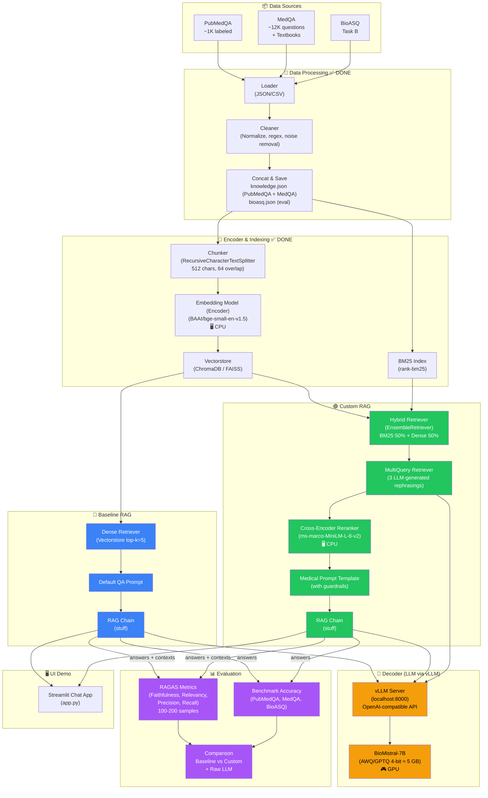
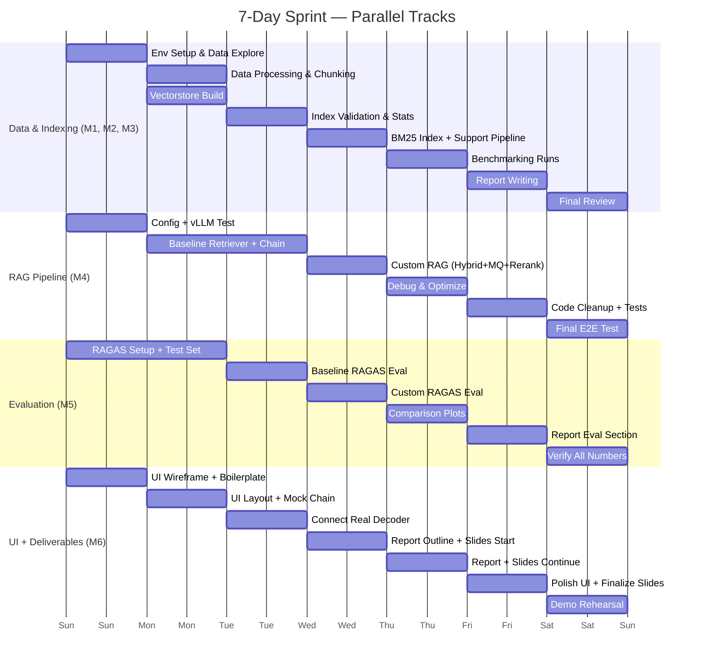

# Medical RAG QA — Sprint Plan (7 Days, 6 Members)

## 1. Project Overview

**Goal:** Build a fully local Medical Question Answering system using RAG (Retrieval-Augmented Generation), evaluated on PubMedQA, MedQA, and BioASQ.

**Key Constraint:** Everything runs on **1× RTX 3060 (12 GB VRAM)**. Zero external APIs.

**Deliverables:** Working RAG pipeline (Baseline + Custom), RAGAS evaluation results, Chat UI demo, Source code, Slides & Report.

---

## 2. Pipeline Architecture Diagram



> **Color legend:** 🔵 Blue = Baseline RAG &nbsp;|&nbsp; 🟢 Green = Custom RAG &nbsp;|&nbsp; 🟡 Yellow = Decoder LLM (vLLM) &nbsp;|&nbsp; 🟣 Purple = Evaluation

---

## 3. Tech Stack

| Component | Choice | Rationale |
|-----------|--------|-----------|
| **Encoder** | **BAAI/bge-small-en-v1.5** (384-dim, ~130 MB) via `HuggingFaceEmbeddings` | Small, fast, runs on **CPU** while decoder holds the GPU. Normalize embeddings for cosine similarity. |
| **Decoder (LLM)** | **BioMistral-7B** (AWQ/GPTQ 4-bit) via **vLLM** | Medical-domain 7B model. 4-bit quantized ≈ 5 GB VRAM — leaves ~7 GB headroom. vLLM provides OpenAI-compatible API with continuous batching and high throughput. |
| **Vector DB** | **ChromaDB** (local, persistent) or **FAISS** | Configurable via `config.yaml`. ChromaDB = zero-config with persistence. FAISS = in-memory, faster search. |
| **Framework** | **LangChain** | Required by project spec. Provides chains, retrievers, prompt templates, and document loaders. |
| **Config** | **OmegaConf** (YAML) + `.env` (secrets) | `configs/config.yaml` (git-tracked) + `configs/config.local.yaml` (gitignored override). |
| **Evaluation** | **RAGAS** with local LLM | Configured to use the same vLLM endpoint instead of default OpenAI. |
| **UI** | **Streamlit** or **Gradio** | Single-file chat UI, fast to build, no frontend skills needed. |

> [!IMPORTANT]
> **VRAM Budget (RTX 3060 — 12 GB):**
> - BioMistral-7B 4-bit (AWQ/GPTQ) ≈ **5 GB**
> - vLLM KV cache / overhead ≈ **3–4 GB**
> - Encoder runs on **CPU** → **0 GPU**
> - Vectorstore on **CPU RAM** → **0 GPU**
> - Total GPU usage ≈ **8–9 GB / 12 GB** ✅ Safe margin

### vLLM Setup

```bash
# Install vLLM
pip install vllm

# Serve BioMistral-7B (4-bit quantized) — OpenAI-compatible API
python -m vllm.entrypoints.openai.api_server \
    --model BioMistral/BioMistral-7B-GGUF \
    --quantization awq \
    --dtype half \
    --max-model-len 4096 \
    --gpu-memory-utilization 0.7 \
    --port 8000

# Verify — OpenAI-compatible endpoint
curl http://localhost:8000/v1/models
curl http://localhost:8000/v1/completions \
    -H "Content-Type: application/json" \
    -d '{"model":"BioMistral-7B","prompt":"What is hypertension?","max_tokens":100}'
```

### Why vLLM over Ollama?

| Aspect | vLLM | Ollama |
|--------|------|--------|
| **Throughput** | Continuous batching, PagedAttention → **2–4× faster** | Sequential processing |
| **API** | Full OpenAI-compatible (`/v1/completions`, `/v1/chat/completions`) | Custom API + partial OpenAI compat |
| **Quantization** | AWQ, GPTQ, FP8, GGUF support | GGUF only |
| **GPU Utilization** | Fine-grained `--gpu-memory-utilization` knob | Less control |
| **Batch Eval** | Can handle concurrent RAGAS eval requests efficiently | Bottleneck on serial requests |

### Alternative LLM Options

| Model | VRAM (4-bit) | Notes |
|-------|-------------|-------|
| `meditron-7b` | ~5 GB | Medical-domain, good fallback |
| `mistral-7b` | ~5 GB | General but strong reasoning |
| `llama3-8b` | ~5.5 GB | Newest, excellent quality |
| `Qwen2.5-7B` | ~5 GB | Strong multilingual + reasoning |

---

## 4. Datasets

| Dataset | Size | Format | Use |
|---------|------|--------|-----|
| **PubMedQA** | ~1,000 expert-labeled | CSV → JSON | Yes/No/Maybe QA. Contexts → knowledge base, labels → eval. |
| **MedQA** (USMLE) | ~12,000+ questions + textbooks | TXT (textbooks) | Textbooks → knowledge base (cleaned & preprocessed), questions → eval. |
| **BioASQ** (Task B) | ~3,700+ questions | CSV → JSON | Question + ideal_answer pairs → evaluation set. |

### Data Processing Pipeline ✅ DONE

```
Raw CSV/TXT → Parse & Clean (preprocess.py) → Concat → JSON outputs
```

**Preprocessing** (`src/data/preprocess.py`):
- **PubMedQA:** Extract contexts from CSV, concat into single text per doc → `knowledge.json`
- **MedQA textbooks:** Clean noise (headers, page numbers, boilerplate, figure refs, URLs, non-ASCII) → `knowledge.json`
- **BioASQ:** Extract question + ideal_answer pairs → `bioasq.json` (for evaluation)

**Output:**
- `data/processed/knowledge/knowledge.json` — PubMedQA contexts + MedQA textbooks (knowledge base for RAG)
- `data/processed/bioasq/bioasq.json` — BioASQ Q&A pairs (evaluation set)

**Chunking** (next step, `src/data/chunker.py`):
- `RecursiveCharacterTextSplitter` (LangChain)
- `chunk_size=512`, `chunk_overlap=64`
- Separators: `["\n\n", "\n", ". ", " ", ""]`
- Attach metadata: `source`, `doc_id`

---

## 5. Pipeline Architecture

### 5.1 Baseline RAG (Linear / Naive)

```
Question → Embed (Encoder) → Vectorstore Top-K → Stuff into Prompt → Decoder (LLM) → Answer
```

```python
from langchain_community.vectorstores import Chroma
from langchain_community.embeddings import HuggingFaceEmbeddings
from langchain_openai import ChatOpenAI  # vLLM is OpenAI-compatible
from langchain.chains import RetrievalQA

# Encoder (Embedding)
encoder = HuggingFaceEmbeddings(
    model_name="BAAI/bge-small-en-v1.5",
    model_kwargs={"device": "cpu"},
    encode_kwargs={"normalize_embeddings": True}
)

# Vectorstore
vectorstore = Chroma(
    persist_directory="data/vectorstore",
    embedding_function=encoder,
    collection_name="bio-med-rag"
)
retriever = vectorstore.as_retriever(search_kwargs={"k": 5})

# Decoder (LLM via vLLM)
decoder = ChatOpenAI(
    openai_api_base="http://localhost:8000/v1",
    openai_api_key="EMPTY",
    model_name="BioMistral-7B",
    temperature=0,
    max_tokens=512
)

# Baseline chain
baseline_chain = RetrievalQA.from_chain_type(
    llm=decoder,
    chain_type="stuff",
    retriever=retriever,
    return_source_documents=True
)
```

### 5.2 Custom RAG (Enhanced — for comparison)

Apply **2–3 low-effort, high-impact techniques** on top of Baseline:

---

#### Technique 1: Hybrid Search (BM25 + Dense)

**Why:** Pure dense retrieval can miss keyword-heavy medical terms (drug names, disease codes). BM25 catches exact lexical matches.

```python
from langchain.retrievers import EnsembleRetriever
from langchain_community.retrievers import BM25Retriever

bm25_retriever = BM25Retriever.from_documents(documents, k=5)
faiss_retriever = vectorstore.as_retriever(search_kwargs={"k": 5})

hybrid_retriever = EnsembleRetriever(
    retrievers=[bm25_retriever, faiss_retriever],
    weights=[0.5, 0.5]
)
```

---

#### Technique 2: Multi-Query Retriever

**Why:** A single question phrasing may miss relevant chunks. LLM generates 3 rephrasings → retrieves from each → merges results.

```python
from langchain.retrievers import MultiQueryRetriever

multi_query_retriever = MultiQueryRetriever.from_llm(
    retriever=hybrid_retriever,
    llm=decoder  # Uses vLLM decoder
)
```

---

#### Technique 3: Re-Ranking with Cross-Encoder (Optional, CPU)

**Why:** Re-ranks the top-K retrieved documents by relevance. Low cost, high precision gain.

```python
from langchain.retrievers import ContextualCompressionRetriever
from langchain_community.document_compressors import CrossEncoderReranker
from langchain_community.cross_encoders import HuggingFaceCrossEncoder

reranker_model = HuggingFaceCrossEncoder(model_name="cross-encoder/ms-marco-MiniLM-L-6-v2")
compressor = CrossEncoderReranker(model=reranker_model, top_n=3)

reranking_retriever = ContextualCompressionRetriever(
    base_compressor=compressor,
    base_retriever=hybrid_retriever
)
```

---

#### Custom RAG — Full Chain

```python
from langchain.chains import RetrievalQA
from langchain.prompts import PromptTemplate

medical_prompt = PromptTemplate(
    input_variables=["context", "question"],
    template="""You are a biomedical expert assistant.
Answer the question using ONLY the information in the provided context.
If the context does not contain enough information, say "I don't know."
Be concise and precise.

Context:
{context}

Question: {question}
Answer:"""
)

custom_chain = RetrievalQA.from_chain_type(
    llm=decoder,  # vLLM decoder
    chain_type="stuff",
    retriever=reranking_retriever,
    return_source_documents=True,
    chain_type_kwargs={"prompt": medical_prompt}
)
```

---

### 5.3 Baseline vs Custom — Comparison Summary

| Aspect | Baseline RAG | Custom RAG |
|--------|-------------|------------|
| Retriever | Dense only (top-5) | Hybrid (BM25 + Dense) + MultiQuery |
| Re-ranking | None | Cross-encoder re-rank (top-3) |
| Prompt | Default LangChain QA prompt | Medical-specific prompt with guardrails |
| Expected Gain | — | +5–15% on retrieval recall, +faithfulness |

---

## 6. RAGAS Evaluation with Local LLM

### The Problem

RAGAS by default calls `OpenAI` for its judge LLM. We need to override this with our local vLLM model.

### Solution: Point RAGAS at vLLM

```python
from ragas import evaluate
from ragas.metrics import faithfulness, answer_relevancy, context_precision, context_recall
from ragas.llms import LangchainLLMWrapper
from ragas.embeddings import LangchainEmbeddingsWrapper
from langchain_openai import ChatOpenAI
from langchain_community.embeddings import HuggingFaceEmbeddings
from datasets import Dataset

# 1. Decoder (vLLM) as RAGAS judge
decoder = ChatOpenAI(
    openai_api_base="http://localhost:8000/v1",
    openai_api_key="EMPTY",
    model_name="BioMistral-7B",
    temperature=0
)
ragas_llm = LangchainLLMWrapper(decoder)

# 2. Encoder for RAGAS
encoder = HuggingFaceEmbeddings(model_name="BAAI/bge-small-en-v1.5")
ragas_embeddings = LangchainEmbeddingsWrapper(encoder)

# 3. Prepare evaluation dataset (100–200 samples)
eval_data = {
    "question": [...],
    "answer": [...],
    "contexts": [...],
    "ground_truth": [...],
}
eval_dataset = Dataset.from_dict(eval_data)

# 4. Run RAGAS — fully offline
results = evaluate(
    dataset=eval_dataset,
    metrics=[faithfulness, answer_relevancy, context_precision, context_recall],
    llm=ragas_llm,
    embeddings=ragas_embeddings,
)
print(results)
```

> [!WARNING]
> **Speed tip:** vLLM's continuous batching makes RAGAS eval ~2–4× faster than Ollama, but still limit evaluation to **100–200 random samples** to finish in reasonable time.

### RAGAS Metrics Explained

| Metric | What it Measures | Needs Ground Truth? |
|--------|-----------------|---------------------|
| **Faithfulness** | Are LLM claims supported by retrieved context? | No |
| **Answer Relevancy** | Does the answer address the question? | No |
| **Context Precision** | Are relevant docs ranked higher? | Yes |
| **Context Recall** | Did retrieval find all needed info? | Yes |

---

## 7. Project Structure

```
bio-med-rag/
├── configs/
│   ├── config.yaml                # Base config (git-tracked)
│   └── config.local.yaml.example  # Contributor override template
│
├── src/
│   ├── config/
│   │   └── loader.py              # OmegaConf config loader (base + local merge)
│   │
│   ├── data/
│   │   ├── preprocess.py          # ✅ Clean PubMedQA + MedQA + BioASQ → JSON
│   │   ├── loader.py              # Load processed JSON into LangChain Documents
│   │   └── chunker.py             # RecursiveCharacterTextSplitter
│   │
│   ├── embeddings/
│   │   └── encoder.py             # HuggingFace embedding model (Encoder)
│   │
│   ├── vectorstore/
│   │   └── store.py               # ChromaDB / FAISS build + load + persist
│   │
│   ├── retriever/
│   │   └── retriever.py           # Dense, BM25, Hybrid, MultiQuery retrievers
│   │
│   ├── llm/
│   │   └── decoder.py             # vLLM-backed Decoder LLM (OpenAI-compatible)
│   │
│   ├── pipeline/
│   │   └── rag_chain.py           # Baseline & Custom RAG chains
│   │
│   └── evaluation/
│       └── evaluator.py           # RAGAS evaluation + benchmark accuracy
│
├── scripts/
│   ├── ingest.py                  # Build vectorstore from processed data
│   └── query.py                   # Run RAG query from CLI
│
├── notebooks/
│   └── 00_EDA.ipynb               # Exploratory Data Analysis
│
├── data/                          # (gitignored)
│   ├── external/                  # Raw datasets (downloaded via set_up_dataset.py)
│   │   ├── pubmedqa/
│   │   ├── medqa/
│   │   └── bioasq/
│   ├── processed/                 # Preprocessed JSON outputs
│   │   ├── knowledge/knowledge.json  # PubMedQA + MedQA combined
│   │   └── bioasq/bioasq.json       # BioASQ eval set
│   └── vectorstore/               # Persisted embeddings
│
├── results/
│   └── evaluation/                # Saved metrics, plots, CSVs
│
├── .env.example                   # Environment variables template
├── .gitignore
├── requirements.txt
├── set_up_dataset.py              # Download datasets from HuggingFace
├── plan.md                        # This file
└── README.md
```

---

## 8. Seven-Day Sprint Plan (6 Members)

### Team Roles

| ID | Member | Primary Role | Track |
|----|--------|-------------|-------|
| **M1** | Duy Anh | Data Engineer — PubMedQA | Data & Indexing |
| **M2** | Vinh | Data Engineer — MedQA | Data & Indexing |
| **M3** | Ngọc | Data Engineer — Chunking & VectorDB | Data & Indexing |
| **M4** | Copper | RAG Pipeline Engineer — Baseline + Custom | RAG Pipeline |
| **M5** | Tùng | Evaluation Engineer — RAGAS + Benchmarks | Evaluation |
| **M6** | Lâm | UI + Demo + Report/Slides | UI & Deliverables |

---

### Day 1 (Mon) — Environment Setup & Data Exploration

| Time | M1 (Duy Anh) | M2 (Vinh) | M3 (Ngọc) | M4 (Copper) | M5 (Tùng) | M6 (Lâm) |
|------|--------------|-----------|-----------|-------------|-----------|-----------|
| AM | Install Python env, clone repo, install deps | ← same | ← same | Install vLLM, serve BioMistral-7B, verify API at `localhost:8000` | ← help M4 test vLLM | Set up project structure |
| PM | ✅ Load PubMedQA, explore structure | ✅ Load MedQA, explore textbooks | Research `RecursiveCharacterTextSplitter`, test chunk sizes | Write `decoder.py` (vLLM OpenAI-compat client). Test basic LLM call | Install RAGAS, read docs. Write skeleton `evaluator.py` | Design UI wireframe. Init `app.py` |

**Day 1 Deliverables:**
- ✅ All environments working
- ✅ vLLM serving BioMistral-7B locally
- ✅ Raw data loaded and explored
- ✅ `configs/config.yaml` finalized

---

### Day 2 (Tue) — Data Processing & Embedding Pipeline

| Time | M1 (Duy Anh) | M2 (Vinh) | M3 (Ngọc) | M4 (Copper) | M5 (Tùng) | M6 (Lâm) |
|------|--------------|-----------|-----------|-------------|-----------|-----------|
| AM | ✅ `preprocess.py` — clean PubMedQA text | ✅ `preprocess.py` — clean MedQA textbooks | Write `chunker.py` — `RecursiveCharacterTextSplitter(chunk_size=512, chunk_overlap=64)` | Write `encoder.py` — init `HuggingFaceEmbeddings("BAAI/bge-small-en-v1.5")`. Test speed | Create eval test set: sample 100–200 questions from PubMedQA + MedQA + BioASQ | Build chat UI layout |
| PM | ✅ Concat PubMedQA + MedQA → `knowledge.json` | ✅ Process BioASQ → `bioasq.json` | Run chunking on all docs. Write `loader.py` | Write `store.py` — build vectorstore from chunks. Save to disk | Format eval data for RAGAS | Connect UI to mock chain |

**Day 2 Deliverables:**
- ✅ All data cleaned, chunked, metadata attached
- ✅ Vectorstore built and persisted
- ✅ Eval test set (100–200 samples) ready
- ✅ UI layout functional with mock data

---

### Day 3 (Wed) — Baseline RAG Pipeline

| Time | M1 (Duy Anh) | M2 (Vinh) | M3 (Ngọc) | M4 (Copper) | M5 (Tùng) | M6 (Lâm) |
|------|--------------|-----------|-----------|-------------|-----------|-----------|
| AM | Validate index: run sample queries, check retrieved docs | ← help M1 | Tune retrieval `k` (test k=3,5,10) | Write `retriever.py` — baseline. Write `rag_chain.py` — baseline chain | Get RAGAS working with vLLM: test `LangchainLLMWrapper` on 5 samples | Connect real vLLM decoder to UI |
| PM | Write data stats script | Help M5: Run baseline on 20 eval questions | ← help M4 test edge cases | Test baseline chain end-to-end. Fix prompt issues | Run full RAGAS eval on Baseline RAG (100–200 samples) | Display source documents in UI sidebar |

**Day 3 Deliverables:**
- ✅ Baseline RAG pipeline fully working
- ✅ Baseline RAGAS scores collected
- ✅ UI connected to real decoder

---

### Day 4 (Thu) — Custom RAG Pipeline

| Time | M1 (Duy Anh) | M2 (Vinh) | M3 (Ngọc) | M4 (Copper) | M5 (Tùng) | M6 (Lâm) |
|------|--------------|-----------|-----------|-------------|-----------|-----------|
| AM | Write BM25 retriever | Help M1 with BM25 testing | Write medical prompt template in `rag_chain.py` | Implement `EnsembleRetriever` (Hybrid) in `retriever.py` | Analyze Baseline RAGAS results. Identify weak points | Start Report outline |
| PM | Test BM25 vs dense-only | Implement `MultiQueryRetriever` | Implement `CrossEncoderReranker` in `retriever.py` (CPU) | Assemble Custom chain. Test end-to-end | Run full RAGAS eval on Custom RAG | Start Slides |

**Day 4 Deliverables:**
- ✅ Custom RAG pipeline fully working (Hybrid + MultiQuery + Reranker + Medical Prompt)
- ✅ Custom RAGAS scores collected
- ✅ Report outline & initial slides done

---

### Day 5 (Fri) — Benchmarking & Comparison

| Time | M1 (Duy Anh) | M2 (Vinh) | M3 (Ngọc) | M4 (Copper) | M5 (Tùng) | M6 (Lâm) |
|------|--------------|-----------|-----------|-------------|-----------|-----------|
| AM | Write benchmark — PubMedQA test set, Baseline | Write benchmark — MedQA test set, Baseline | Raw LLM (no retrieval) on same test sets for comparison | Debug & optimize Custom RAG | Write comparison table + bar charts (matplotlib) | Continue slides |
| PM | Run Custom on PubMedQA | Run Custom on MedQA | Help M5 compile results | Finalize both chains. Write smoke tests | Generate comparison plots | Write Methods section |

**Day 5 Deliverables:**
- ✅ Benchmark accuracy: Raw LLM vs Baseline RAG vs Custom RAG
- ✅ All comparison plots generated
- ✅ Methods section drafted

---

### Day 6 (Sat) — Report, Slides, Polish

| Time | M1 (Duy Anh) | M2 (Vinh) | M3 (Ngọc) | M4 (Copper) | M5 (Tùng) | M6 (Lâm) |
|------|--------------|-----------|-----------|-------------|-----------|-----------|
| AM | Write Report: Data section | Write Report: Results section | Proofread & format | Code cleanup: docstrings, type hints. Update README | Write Report: Evaluation section | Finalize Slides |
| PM | Review slides | Write Report: Discussion | Write Report: Conclusion & References | Final code review. Complete `requirements.txt` | Review all numbers | Add UI polish. Prepare live demo |

**Day 6 Deliverables:**
- ✅ Report 90% complete
- ✅ Slides 90% complete
- ✅ Codebase clean and documented
- ✅ UI polished

---

### Day 7 (Sun) — Final Review & Rehearsal

| Time | M1 (Duy Anh) | M2 (Vinh) | M3 (Ngọc) | M4 (Copper) | M5 (Tùng) | M6 (Lâm) |
|------|--------------|-----------|-----------|-------------|-----------|-----------|
| AM | Full team review: read Report, fix issues | ← | ← | Run complete end-to-end test | Verify all numbers match outputs | Prepare demo script |
| PM | Rehearse presentation (2–3 dry runs) | ← | ← | ← | ← | ← |
| Evening | Final fixes. Push to Git | ← | ← | ← | ← | ← |

**Day 7 Deliverables:**
- ✅ Report finalized
- ✅ Slides finalized
- ✅ Demo tested and rehearsed
- ✅ All code pushed to repository

---

## 9. Parallel Track Dependency Map



### Critical Dependencies

| Blocker | Who Waits | Resolution |
|---------|-----------|------------|
| Vectorstore must exist | M4 (builds chain) | M3 delivers index end of Day 2. M4 can use mock retriever on Day 2 AM |
| vLLM must be serving | Everyone | M4 sets up Day 1 AM. Takes ~10 min |
| Baseline chain must work | M5 (runs RAGAS) | M4 delivers baseline end of Day 3 AM |
| Custom chain must work | M5 (runs RAGAS) | M4 delivers custom end of Day 4 AM |
| All results ready | M6 (report/slides) | M5 delivers end of Day 5 |

---

## 10. Requirements

```txt
# Core
langchain>=0.3.0
langchain-community>=0.3.0
langchain-openai>=0.1.0

# Decoder LLM
vllm>=0.4.0

# Embeddings & Reranking (Encoder)
sentence-transformers>=2.2.0
transformers>=4.36.0
torch>=2.0.0

# Vectorstore
chromadb>=0.4.0
# faiss-cpu>=1.7.4  # uncomment if using FAISS backend

# Data
datasets>=2.14.0
pandas>=2.0.0

# Config
omegaconf>=2.3.0
python-dotenv>=1.0.0
huggingface_hub>=0.20.0

# Evaluation
ragas>=0.1.0

# BM25
rank-bm25>=0.2.2

# UI
streamlit>=1.28.0

# Utilities
tqdm>=4.65.0
matplotlib>=3.7.0
```

---

## 11. Risk Mitigation

| Risk | Impact | Mitigation |
|------|--------|------------|
| vLLM install issues (CUDA version) | Can't serve model | Fallback: use `text-generation-inference` or HF Transformers pipeline |
| BioMistral quantized weights unavailable | Can't fit in VRAM | Use `mistral-7b` or `Qwen2.5-7B` AWQ — similar size |
| RAGAS too slow on local LLM | Can't finish eval | vLLM batching helps. Reduce sample to 50 if still slow |
| Vectorstore too large for RAM | OOM on CPU | Use FAISS `IVF` index or reduce chunk count |
| Embedding model slow on CPU | Indexing takes hours | Batch embedding (`batch_size=64`). Use GPU if decoder not loaded |
| Team member stuck | Delays cascade | Daily 15-min standup. Escalate blockers immediately |
| Cross-encoder reranker too slow | Custom RAG bottleneck | Skip reranking, rely on Hybrid + MultiQuery only |

---

## 12. Expected Results (Rough Targets)

| Metric | Baseline RAG | Custom RAG | Target Improvement |
|--------|-------------|------------|-------------------|
| RAGAS Faithfulness | ~0.5–0.6 | ~0.65–0.75 | +10–15% |
| RAGAS Answer Relevancy | ~0.6–0.7 | ~0.7–0.8 | +10% |
| RAGAS Context Precision | ~0.4–0.5 | ~0.55–0.65 | +15% |
| RAGAS Context Recall | ~0.5–0.6 | ~0.6–0.7 | +10% |
| PubMedQA Accuracy | ~55–65% | ~65–75% | +10% |
| MedQA Accuracy | ~35–45% | ~40–50% | +5–10% |

> [!NOTE]
> These are rough estimates. Actual numbers depend on data quality, prompt engineering, and model capabilities. The goal is to show **measurable improvement** from Baseline → Custom, not to hit specific targets.

---

## 13. Quick Reference — Key Commands

```bash
# Start vLLM server (must be running for everything)
python -m vllm.entrypoints.openai.api_server \
    --model BioMistral/BioMistral-7B \
    --quantization awq \
    --dtype half \
    --max-model-len 4096 \
    --gpu-memory-utilization 0.7 \
    --port 8000

# Download datasets
python set_up_dataset.py

# Preprocess data (PubMedQA + MedQA + BioASQ)
python src/data/preprocess.py

# Build vectorstore
python scripts/ingest.py

# Run RAG query
python scripts/query.py --question "What is BCR-ABL?"

# Run RAGAS Evaluation
python -m src.evaluation.evaluator --pipeline baseline --samples 200
python -m src.evaluation.evaluator --pipeline custom --samples 200

# Launch UI
streamlit run ui/app.py

# Run Tests
pytest tests/
```
